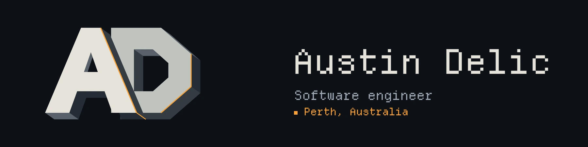
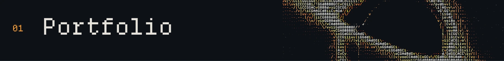
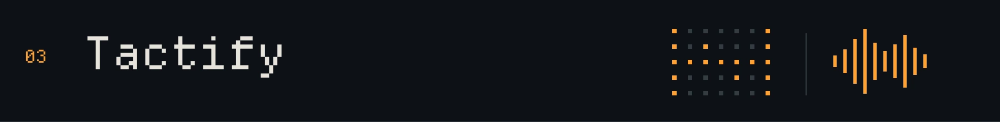

<a href="https://austindelic.com"></a>

I'm Austin, a software engineer in Perth and Founding Engineer at **The Next Something**.

I build web applications, Rust tools, and graphics you can explore in a browser or terminal.

[Portfolio ↗](https://austindelic.com) · [Email](mailto:austin@austindelic.com) · [LinkedIn ↗](https://www.linkedin.com/in/austindelic)

## Selected work

<h3><a href="https://austindelic.com"></a></h3>

A website and a native terminal app, built around an interactive ASCII black hole. Shared content and shaders connect the two.

**Astro · React · Rust · Ratatui · wgpu**

[Explore the website ↗](https://austindelic.com) · [Terminal source](./apps/tui/) · [Shared shaders](./packages/black-hole/)

<h3><a href="https://github.com/austindelic/still"></a></h3>

A project environment manager that makes setup explicit: typed configuration, installation plans, lockfiles, and trust checks when your config changes.

**Rust · CLI + TUI · TOML**

[View source ↗](https://github.com/austindelic/still) · [Why I'm building it ↗](https://austindelic.com/blog/still-and-desired-state/)

<h3><a href="https://austindelic.com/blog/building-tactify/"></a></h3>

Turns visual learning material into tactile SVG graphics and guided audio for blind and low-vision users. Started at Perth Hackerhouse.

**Next.js · Go · SVG · Audio**

[Read the build notes ↗](https://austindelic.com/blog/building-tactify/)

##  Run the portfolio

Explore the black hole from your terminal:

```sh
npx austindelic
```

<details>
<summary>Requirements and controls</summary>

Requires **Node 22+** and a terminal of at least **60 × 18 characters**. Runs on macOS, Linux, and Windows; see the [platform requirements](./apps/tui/npm/README.md) for supported versions and architectures.

Use **Tab / arrows** to navigate, **Enter** to open, and **?** for help. In Explore, move with **WASD**, **IJKL**, or mouse dragging. **Ctrl-C** quits; **q** also quits outside Explore.

The GPU renderer runs locally and falls back to static artwork if graphics initialization fails. Portfolio content is embedded and works offline after installation; external links need a connection.

</details>

<details>
<summary>Inside this repo</summary>

- [Web portfolio](./apps/portfolio/) — Astro, React, and the browser renderer.
- [Terminal portfolio](./apps/tui/) — Rust, Ratatui, and wgpu.
- [Shared shaders](./packages/black-hole/) — rendering source and shader attribution.
- [Infrastructure](./infra/) — hosting configuration.
- [README artwork](./assets/readme/ARTWORK.md) — source capture, typography, and reproduction instructions.

Start the web portfolio with Bun:

```sh
bun install
bun run dev
```

Open <http://localhost:4321>. For the native app, follow the [terminal development instructions](./apps/tui/README.md).

</details>

---

[Austin Develops ↗](https://youtube.com/@austindevelops)

<details>
<summary>On repeat</summary>

[](https://github.com/kittinan/spotify-github-profile)

</details>
